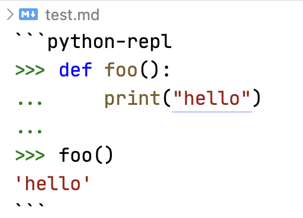
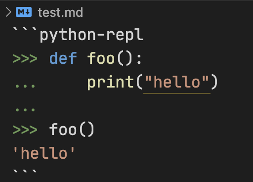

# VSCode Markdown Python REPL syntax support

Python REPL syntax highlight support for markdown fenced code blocks. Use
"python-repl" as a language specifier after fenced code blocks. How it
will look like with different color themes:

### Light+ color theme

### Dark+ color theme

### grigoryvp memory color theme

## License

The following licensing applies to VSCode Markdown Python REPL syntax support:
Attribution-NonCommercial-NoDerivatives 4.0 International
(CC-BY-NC-ND-4.0). For more information go to
[https://creativecommons.org/licenses/by-nc-nd/4.0/](https://creativecommons.org/licenses/by-nc-nd/4.0/)
